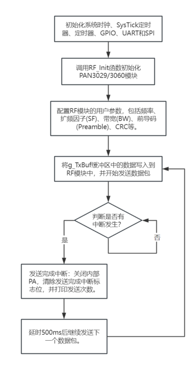
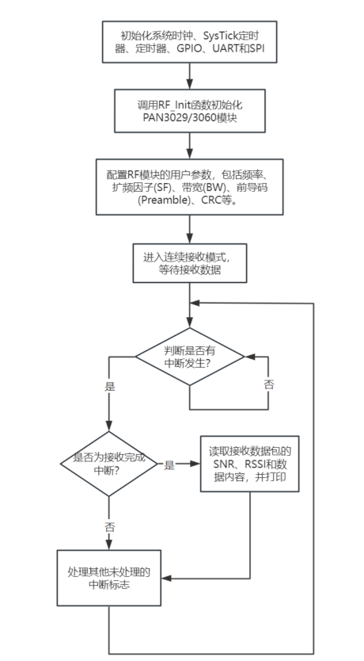

# 01_normal_trx例程
## 1.功能描述
本代码示例主要演示了PAN3029/3060进行简单的发送/接收功能测试。本功能需要两块开发板进行共同演示，一块开发板用于数据包发送，另一块开发板用于数据包接收。

## 2.环境要求
*   Board: 两块 PAN3029 开发板
*   Mini USB线2根，用于给开发板供电和查看串口打印Log
*   J-Link下载器一个，用于程序下载
*   将 J1，J4用跳帽连接

## 3.编译和烧录
**Tx端：** 
例程位置：`01_SDK/example/01_normal_trx/tx/keil`
打开目录下的tx.uvprojx工程，并编译整个代码工程。

**Rx端：** 
例程位置：`01_SDK/example/01_normal_trx/rx/keil`
打开目录下的rx.uvprojx工程，并编译整个代码工程。

## 4.Tx端
**代码流程：** 



**主要代码：** 

```c
    ret = RF_Init();       /* PAN3029/3060初始化 */
    RF_ConfigUserParams(); /* 配置 Frequency、SF、BW、Preamble、CRC等参数 */
    while(1)
    {
        RF_TxSinglePkt(g_TxBuf, sizeof(g_TxBuf)); /* 发送数据包 */
        while (1)
        {
            if (CHECK_RF_IRQ()) /* 检测到RF中断，高电平表示有中断 */
            {
                uint8_t IRQFlag = RF_GetIRQFlag(); /* 获取中断标志位 */
                if (IRQFlag & RF_IRQ_TX_DONE)      /* 发送完成中断 */
                {
                    RF_TurnoffPA();                /* 发送完成后须关闭PA */
                    RF_ClrIRQFlag(RF_IRQ_TX_DONE); /* 清除发送完成中断标志位 */
                    IRQFlag &= ~RF_IRQ_TX_DONE;
                    RF_EnterStandbyState();        /* 发送完成后须设置为RF_STATE_STB3状态 */
                    break;
                }
            }
        }
        SysTick_Delay(500); /* 延时500ms */
    }
```
## 5.Rx端
**代码流程：** 



**主要代码：** 

```c
    ret = RF_Init();        /* PAN3029/3060初始化 */
    RF_ConfigUserParams();  /* 配置frequency、SF、BW、Preamble、CRC等参数 */
    RF_EnterContinousRxState(); /* 进入连续接收状态 */
    while (1)
    {
        if (CHECK_RF_IRQ()) /* 检测到RF中断，高电平表示有中断 */
        {
            uint8_t IRQFlag = RF_GetIRQFlag(); /* 获取中断标志位 */
            if (IRQFlag & RF_IRQ_RX_DONE) /* 接收完成中断 */
            {
                g_RfRxPkt.Snr = RF_GetPktSnr();   /* 获取接收数据包的SNR值 */
                g_RfRxPkt.Rssi = RF_GetPktRssi(); /* 获取接收数据包的RSSI值 */
                
                /* 获取接收数据和长度 */
                g_RfRxPkt.RxLen = RF_GetRecvPayload((uint8_t *)g_RfRxPkt.RxBuf);
                RF_ClrIRQFlag(RF_IRQ_RX_DONE); /* 清除接收完成中断标志位 */
                IRQFlag &= ~RF_IRQ_RX_DONE;
            }
            /* 清除未处理的中断标志位 */
        }
    }
```


## 6.例程演示
1. 找到两块PAN3029开发板，将Tx端和Rx端例程分别烧录到对应开发板上。
2. 打开串口调试助手，设置波特率为115200bps，数据位8位，无校验位，停止位1位。分别选择Tx端和Rx端的串口，点击连接。
3. 观察Tx端和Rx端的串口调试助手，Tx端会打印发送次数，Rx端会打印接收数据。

TX端日志:
```
Tx done, tx count:28
Tx done, tx count:29
Tx done, tx count:30
```
* tx count为发送端发送数据包的计数值，每次发送count都会递增。

RX端日志:
```
+Rx Len=16, Count=28
+RxHexData:
1C 1C 1C 1C 1C 1C 1C 1C 1C 1C 1C 1C 1C 1C 1C 1C 
SNR:8dB, RSSI:-28dBm 

+Rx Len=16, Count=29
+RxHexData:
1D 1D 1D 1D 1D 1D 1D 1D 1D 1D 1D 1D 1D 1D 1D 1D 
SNR:8dB, RSSI:-28dBm 

+Rx Len=16, Count=30
+RxHexData:
1E 1E 1E 1E 1E 1E 1E 1E 1E 1E 1E 1E 1E 1E 1E 1E 
SNR:8dB, RSSI:-28dBm 
```
* Rx Len为有效用户数据长度，Count为接收到数据包的计数值，SF为扩频因子，RxHexData为接收到的16位数据，SNR是信噪比，RSSI为信号强度。
