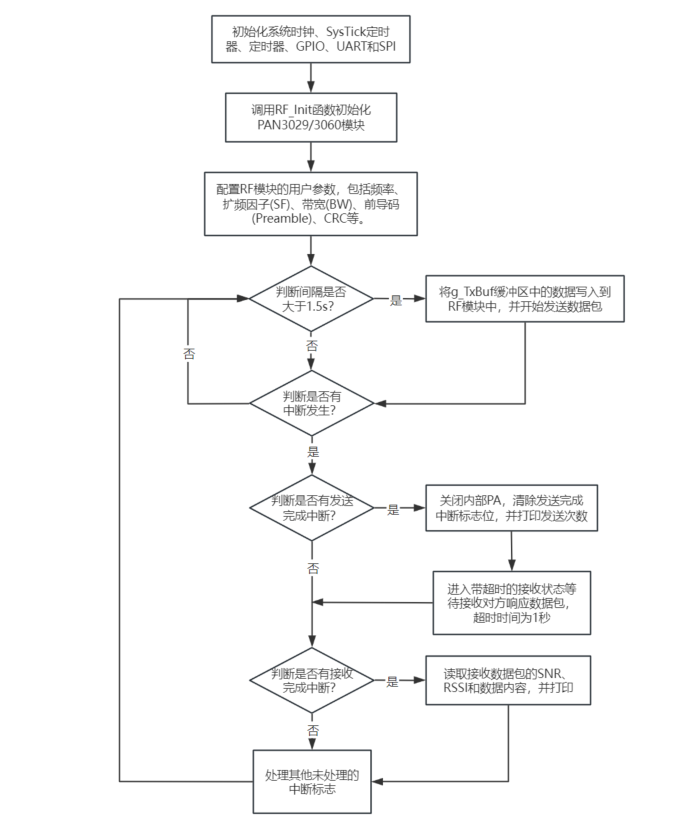
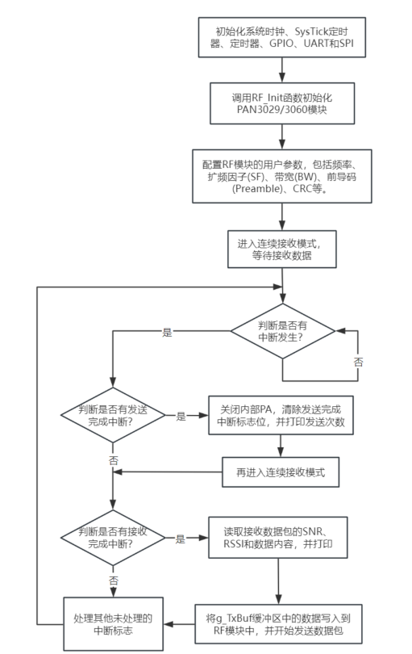

# 02_pingpong例程
## 1.功能描述
本代码示例主要演示了PAN3029/3060模组的收发模式切换功能。
* ping 工程：
  * 周期性执行「发送数据包 → 切换至接收模式保持 1 秒 → 再次发送」的循环流程。
  * 每次发送后等待接收响应，形成 "ping-pong" 交互机制。
* pong 工程：
  * 持续处于接收模式监听数据包。
  * 一旦接收到有效数据，立即自动发送应答包作为响应。

## 2.环境要求
*   Board: PAN3029 开发板
*   Mini USB线2根，用于给开发板供电和查看串口打印Log
*   J-Link下载器一个，用于程序下载
*   将 J1，J4用跳帽连接

## 3.编译和烧录
**ping端：** 
例程位置：`01_SDK/example/02_pingpong/ping/keil`
打开目录下的ping.uvprojx工程，并编译整个代码工程。

**pong端：** 
例程位置：`01_SDK/example/02_pingpong/pong/keil`
打开目录下的pong.uvprojx工程，并编译整个代码工程。

## 4.ping端
**代码流程：** 



**主要代码：** 
```c
    uint32_t LastSystemTickMs;
    int ret = RF_Init();        /* PAN3029/3060初始化 */
    RF_ConfigUserParams(); /* 配置 Frequency、SF、BW、Preamble、CRC等参数 */
    
    while (1)
    {
        /* 每1.5秒发送一次数据包 */
        if (SysTick_GetTick() - LastSystemTickMs > 1500)
        {
            LastSystemTickMs = SysTick_GetTick(); /* 更新上次打印时间 */
            RF_TxSinglePkt(g_TxBuf, sizeof(g_TxBuf));
        }
        if (CHECK_RF_IRQ()) /* 检测到RF中断，高电平表示有中断 */
        {
            uint8_t IRQFlag = RF_GetIRQFlag();    /* 获取中断标志位 */
            if (IRQFlag & RF_IRQ_TX_DONE) /* 发送完成中断 */
            {
                RF_TurnoffPA();                /* 发送完成后须关闭PA */
                RF_ClrIRQFlag(RF_IRQ_TX_DONE); /* 清除发送完成中断标志位 */
                IRQFlag &= ~RF_IRQ_TX_DONE;
                RF_EnterStandbyState();        /* 发送完成后须设置为RF_STATE_STB3状态 */
                //!< 须在清除发送中断标志位后，再进入接收模式
                RF_EnterSingleRxWithTimeout(1000); /* 进入带超时的接收状态等待接收对方响应数据包，超时时间为1秒 */
            }
            if (IRQFlag & RF_IRQ_RX_DONE) /* 接收完成中断 */
            {
                // 此处打印接收到数据包相关的参数
                RF_ClrIRQFlag(RF_IRQ_RX_DONE); /* 清除接收完成中断标志位 */
                IRQFlag &= ~RF_IRQ_RX_DONE;
            }
            // 此处清理其他未处理的中断标志位
        }
    }
```

## 5.pong端
**代码流程：** 



**主要代码：** 

```c
    int ret = RF_Init();        /* PAN3029/3060初始化 */
    RF_ConfigUserParams();      /* 配置 Frequency、SF、BW、Preamble、CRC等参数 */
    RF_EnterContinousRxState(); /* 进入连续接收模式 */
    while (1)
    {
        if (CHECK_RF_IRQ()) /* 检测到RF中断，高电平表示有中断 */
        {
            uint8_t IRQFlag = RF_GetIRQFlag(); /* 获取中断标志位 */
            if (IRQFlag & RF_IRQ_TX_DONE)      /* 发送完成中断 */
            {
                RF_TurnoffPA();                /* 发送完成后须关闭PA */
                RF_ClrIRQFlag(RF_IRQ_TX_DONE); /* 清除发送完成中断标志位 */
                IRQFlag &= ~RF_IRQ_TX_DONE;
                RF_EnterStandbyState();  /* 发送完成后须设置为RF_STATE_STB3状态 */
                //!< 须在清除发送中断标志位后，再进入连续接收模式
                RF_EnterContinousRxState(); /* 发送完数据包响应后，立即进入连续接收模式 */
            }
            if (IRQFlag & RF_IRQ_RX_DONE) /* 接收完成中断 */
            {
                // 此处打印接收到数据包相关的参数
                RF_ClrIRQFlag(RF_IRQ_RX_DONE); /* 清除接收完成中断标志位 */
                IRQFlag &= ~RF_IRQ_RX_DONE;
                //!< 须在清除接收中断标志位后，再发送数据包
                RF_TxSinglePkt(g_TxBuf, sizeof(g_TxBuf)); /* 收到一包数据后，立即发送一包回复数据包 */
            }
            // 此处清理其他未处理的中断标志位
        }
    }
```


## 6.例程演示
1. 准备两块 PAN3029 开发板，将 ping 端和 pong 端例程分别烧录至对应开发板。
2. 打开串口调试助手，设置波特率 115200bps、数据位 8 位、无校验位、停止位 1 位，分别选择 Ping 端和 Pong 端的串口并点击连接。
3. 观察 Ping 端是否成功发送一个数据包，并接收 Pong 端的响应包。
4. 观察 Pong 端是否接收到 Ping 端发送的数据包，并成功向 Ping 端回发响应包。

**Ping端日志:** 
```
Start sending a data packet.        //发送到Pong端的数据包
Data packet has been sent!
Tx Count:1576

>>RF_IRQ_RX_DONE!                   //接收到来自Pong端的响应包
+RxLen=16, Rx Count=1576
+RxHexData:
00 01 02 03 04 05 06 07 08 09 0A 0B 0C 0D 0E 0F 
SNR:8dB, RSSI:-28dBm 
```

**Pong端日志:** 
```
>>Received a packet!                //接收到来自Ping端的数据包
+RxLen=16, Rx Count=1567
+RxHexData:
00 01 02 03 04 05 06 07 08 09 0A 0B 0C 0D 0E 0F 
SNR:8dB, RSSI:-13dBm 
Start sending a response packet.    //发送到Ping端的响应包
A response packet has been sent!
Tx Count:1567
```
