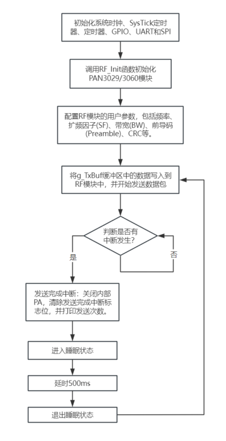
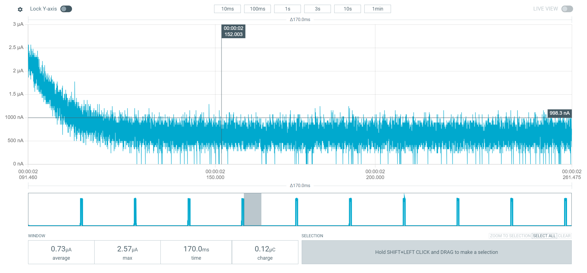

# 03_sleep例程
## 1.功能描述
本代码示例通过交替执行数据发送与睡眠操作，演示 PAN3029/3060 进入 / 退出睡眠模式的功能。模块进入睡眠(Sleep)模式后，RF 模块功耗可低至 1μA 以下，同时完整保存芯片内所有寄存器及运行状态; 当退出睡眠模式时，RF 模块将自动恢复至休眠前的工作状态，确保功能的连续性与稳定性。

## 2.环境要求
*   Board: PAN3029 开发板
*   Mini USB线2根，用于给开发板供电和查看串口打印Log
*   J-Link下载器一个，用于程序下载
*   将 J1，J4用跳帽连接

## 3.编译和烧录
一块开发板打开`01_SDK/example/03_sleep/keil`目录下的sleep.uvprojx工程，并编译烧录代码，进行数据发送和睡眠的验证。
另一块开发板烧录`01_SDK/example/01_normal_trx/rx`示例，进行数据包接收。

## 4.核心接口
**接口声明：** <br>

进入睡眠模式： <br>

```c
void RF_EnterSleepState(void);
```

退出睡眠模式： <br>

```c
void RF_ExitSleepState(void);
```

**接口定义：** 

```c
/**
 * @brief 进入睡眠模式
 * @param[in] <none>
 * @return result
 *        - RF_OK: operate ok
 *       - RF_FAIL: operate fail
 * @note 该函数用于将RF芯片置于睡眠模式，关闭天线供电和TCXO电源
 * @note 该函数会将芯片的工作状态设置为MODE_SLEEP
 * @note 执行该函数后，如需唤醒RF芯片，需要调用RF_ExitSleepState()函数
 */
void RF_EnterSleepState(void)
{
    RF_ShutdownAnt();                   /* 关闭天线 */
    RF_WriteReg(0x02, RF_STATE_STB3);   /* 进入STB3状态 */
    RF_DelayUs(150);                    /* 保证实际延时在150us以上 */
    RF_WriteReg(0x02, RF_STATE_STB2);   /* 进入STB2状态 */
    RF_DelayUs(10);                     /* 保证实际延时在10us以上 */
    RF_WriteReg(0x02, RF_STATE_STB1);   /* 进入STB1状态 */
    RF_DelayUs(10);                     /* 保证实际延时在10us以上 */
    RF_TurnoffTcxo();                   /* 关闭TCXO电源 */
    RF_WriteReg(0x04, 0x16);            /* 关闭LFT */
    RF_DelayUs(10);                     /* 保证实际延时在10us以上 */
    RF_WriteReg(0x02, RF_STATE_SLEEP);  /* 进入SLEEP状态 */
    RF_ResetPageRegBits(3, 0x06, 0x20); /* 关闭ISO */
    RF_DelayUs(10);                     /* 保证实际延时在10us以上 */
    RF_WritePageReg(3, 0x26, 0x0F);     /* 关闭内部电源 */

    g_RfOperatetate = RF_STATE_SLEEP;
}

/**
 * @brief 退出睡眠模式
 * @note 该函数用于将RF芯片退出睡眠模式，打开天线供电和TCXO电源
 * @note 该函数会将芯片的工作状态设置为MODE_STDBY
 */
void RF_ExitSleepState(void)
{
    RF_SetPageRegBits(3, 0x06, 0x20); /* 使能ISO */
    RF_DelayUs(10);                   /* 保证实际延时在10us以上 */
    RF_WriteReg(0x02, RF_STATE_STB1); /* 进入STB1状态 */
    RF_DelayUs(10);                   /* 保证实际延时在10us以上 */
#if USE_ACTIVE_CRYSTAL == 1
    RF_WritePageReg(3, 0x26, 0xA0);   /* 使能内核电源，并打开有源晶振通道 */
    RF_DelayUs(100);                  /* 保证实际延时在100us以上 */
    RF_WriteReg(0x04, 0x36);          /* 使能LFT */
    RF_DelayUs(100);                  /* 保证实际延时在100us以上 */
    RF_TurnonTcxo();                  /* 打开TCXO */
#else
    RF_WritePageReg(3, 0x26, 0x20);   /* 使能内核电源 */
    RF_DelayUs(100);                  /* 保证实际延时在100us以上 */
    RF_WriteReg(0x04, 0x36);          /* 使能LFT */
    RF_DelayUs(100);                  /* 保证实际延时在100us以上 */
#endif
    RF_WriteReg(0x02, RF_STATE_STB2); /* 进入STB2状态 */
    RF_DelayMs(1);                    /* 保证实际延时在1ms以上 */
    RF_WriteReg(0x02, RF_STATE_STB3); /* 进入STB3状态 */
    RF_DelayUs(100);                  /* 保证实际延时在10us以上 */

    g_RfOperatetate = RF_STATE_STB3;
}
```

## 5.应用范例
**代码流程：** 



**主要代码：** 

```c
    while(1)
    {
        RF_TxSinglePkt(g_TxBuf, sizeof(g_TxBuf)); /* 发送数据包 */
        while (1)
        {
            if (CHECK_RF_IRQ()) /* 检测到RF中断，高电平表示有中断 */
            {
                uint8_t IRQFlag = RF_GetIRQFlag(); /* 获取中断标志位 */
                if (IRQFlag & RF_IRQ_TX_DONE)      /* 发送完成中断 */
                {
                    RF_TurnoffPA();                /* 发送完成后须关闭PA */
                    RF_ClrIRQFlag(RF_IRQ_TX_DONE); /* 清除发送完成中断标志位 */
                    IRQFlag &= ~RF_IRQ_TX_DONE;
                    RF_EnterStandbyState();        /* 发送完成后须设置为RF_STATE_STB3状态 */
                    break;                         /* 退出RF中断处理循环 */
                }
                // 此处清理其他未处理的中断标志位
            }
        }
        RF_EnterSleepState(); /* 进入睡眠状态 */
        SysTick_Delay(500);   /* 延时500ms */
        RF_ExitSleepState();  /* 退出睡眠状态 */
    }
```

## 6.例程演示
1. 准备两块 PAN3029 开发板，将发送端(sleep)和接收端分别烧录至对应开发板。
2. 打开串口调试助手，设置波特率 115200bps、数据位 8 位、无校验位、停止位 1 位，分别选择发送端(sleep)和接收端的串口并点击连接。
3. 观察发送端是否成功发送数据包，并进入睡眠状态，并测试rf睡眠电流。
4. 观察接收端是否周期性的接收到发送端的数据包。

**发送端日志:** 

```
Exit sleep status.
Tx Count:8
Enter sleep status.

Exit sleep status.
x Count:9
Enter sleep status.

Exit sleep status.
Tx Count:10
Enter sleep status.
```

**接收端日志:** 
```
+Rx Len=16, Count=8
+RxHexData:
07 07 07 07 07 07 07 07 07 07 07 07 07 07 07 07 
SNR:9dB,RSSI:-13dBm 

+Rx Len=16, Count=9
+RxHexData:
08 08 08 08 08 08 08 08 08 08 08 08 08 08 08 08 
SNR:8dB,RSSI:-13dBm

+Rx Len=16, Count=10
+RxHexData:
09 09 09 09 09 09 09 09 09 09 09 09 09 09 09 09 
SNR:9dB,RSSI:-13dBm 
```

**睡眠功耗** 
在RF模块处于睡眠状态的下，利用电流采样功能检测3029芯片的电流，测得睡眠模式下的平均电流大约在700nA，如下图所示：

