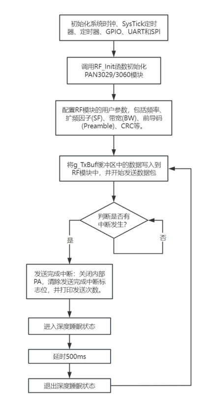
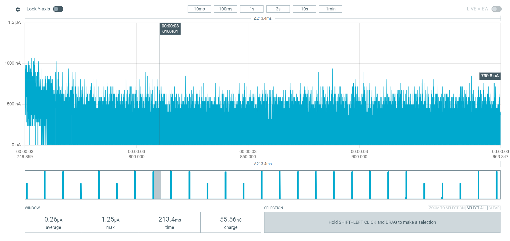

# 04_deepsleep例程
## 1.功能描述
本代码示例通过交替进行发送数据和深度睡眠，演示PAN3029/3060深度睡眠模式进入和退出的功能。模块进入深度睡眠(deepsleep）后，RF 模块的平均功耗会降低至500nA以下，芯片内所有的寄存器和状态会丢失，退出深度睡眠模式需要进行重新初始化芯片并配置rf参数。

## 2.环境要求
*   Board: PAN3029 开发板
*   Mini USB线2根，用于给开发板供电和查看串口打印Log
*   J-Link下载器一个，用于程序下载
*   将 J1，J4用跳帽连接

## 3.编译和烧录
一块开发板打开`01_SDK/example/04_deepsleep/keil`目录下的deepsleep.uvprojx工程，并编译烧录代码，进行数据发送和深度睡眠的验证。
另一块开发板烧录`01_SDK/example/01_normal_trx/rx`示例，进行数据包接收。

## 4.核心接口
**接口申明：** <br>

进入睡眠模式：<br>

```c
void RF_EnterDeepsleepState(void);     /* 进入深度睡眠状态 */
```

退出睡眠模式：<br>

```c
//重新初始化rf芯片，以退出睡眠模式
RF_Init();                /* 重新初始化RF */
RF_ConfigUserParams();    /* 重新配置RF参数 */
```

**接口定义：** 

```c
/**
 * @brief 进入深度睡眠模式
 * @note 该函数用于将RF芯片置于深度睡眠模式，关闭天线供电和TCXO电源
 * @note 该函数会将芯片的工作状态设置为MODE_DEEPSLEEP
 * @note 执行该函数后，如需唤醒RF芯片，需要调用RF_Init()函数唤醒芯片
 */
void RF_EnterDeepsleepState(void)
{
    RF_ShutdownAnt();                      /* 关闭天线 */
    RF_WriteReg(0x02, RF_STATE_STB3);      /* 进入STB3状态 */
    RF_DelayUs(150);                       /* 保证实际延时在150us以上 */
    RF_WriteReg(0x02, RF_STATE_STB2);      /* 进入STB2状态 */
    RF_DelayUs(10);                        /* 保证实际延时在10us以上 */
    RF_WriteReg(0x02, RF_STATE_STB1);      /* 进入STB1状态 */
    RF_DelayUs(10);                        /* 保证实际延时在10us以上 */
#if USE_ACTIVE_CRYSTAL == 1                /* 如果使用有源晶振，则需要关闭TCXO电源 */
    RF_TurnoffTcxo();                      /* 关闭TCXO电源 */
#endif
    RF_WriteReg(0x04, 0x06);               /* 关闭LFT */
    RF_DelayUs(10);                        /* 保证实际延时在10us以上 */
    RF_WriteReg(0x02, RF_STATE_SLEEP);     /* 进入SLEEP状态 */
    RF_DelayUs(10);                        /* 保证实际延时在10us以上 */
    RF_ResetPageRegBits(3, 0x06, 0x20);    /* 关闭ISO */
    RF_DelayUs(10);                        /* 保证实际延时在10us以上 */
    RF_WritePageReg(3, 0x26, 0x00);        /* 关闭内部电源 */
    RF_DelayUs(10);                        /* 保证实际延时在10us以上 */
    RF_WriteReg(0x02, RF_STATE_DEEPSLEEP); /* 进入DEEPSLEEP状态 */
}
```

## 5.应用范例
**代码流程：** 



**主要代码：** 

```c
    while(1)
    {
        RF_TxSinglePkt(g_TxBuf, sizeof(g_TxBuf)); /* 发送数据包 */
        while (1)
        {
            if (CHECK_RF_IRQ()) /* 检测到RF中断，高电平表示有中断 */
            {
                uint8_t IRQFlag = RF_GetIRQFlag(); /* 获取中断标志位 */
                if (IRQFlag & RF_IRQ_TX_DONE)      /* 发送完成中断 */
                {
                    RF_TurnoffPA();                /* 发送完成后须关闭PA */
                    RF_ClrIRQFlag(RF_IRQ_TX_DONE); /* 清除发送完成中断标志位 */
                    IRQFlag &= ~RF_IRQ_TX_DONE;
                    RF_EnterStandbyState();        /* 发送完成后须设置为RF_STATE_STB3状态 */
                    break;                         /* 退出RF中断处理循环 */
                }
                // 此处清理其他未处理的中断标志位
            }
        }
        RF_EnterDeepsleepState(); /* 进入深度睡眠状态 */
        SysTick_Delay(500);       /* 延时500ms */
        RF_Init();                /* 重新初始化RF(退出深度睡眠状态) */
        RF_ConfigUserParams();    /* 重新配置RF参数 */
    }
```
## 6.例程演示

1. 准备两块 PAN3029 开发板，将发送端(deepsleep)和接收端分别烧录至对应开发板。
2. 打开串口调试助手，设置波特率 115200bps、数据位 8 位、无校验位、停止位 1 位，分别选择发送端(deepsleep)和接收端的串口并点击连接。
3. 观察发送端是否成功发送数据包，并进入深度睡眠状态，并测试rf深度睡眠电流。
4. 观察接收端是否周期性的接收到发送端的数据包。

**发送端日志:** 

```
Exit deepsleep status.
Tx Count:8
Enter deepsleep status.

Exit deepsleep status.
Tx Count:9
Enter deepsleep status.

Exit deepsleep status.
Tx Count:10
Enter deepsleep status.
```

**接收端日志:** 

```
+Rx Len=16, Count=8
+RxHexData:
07 07 07 07 07 07 07 07 07 07 07 07 07 07 07 07 
SNR:9dB, RSSI:-13dBm 

+Rx Len=16, Count=9
+RxHexData:
08 08 08 08 08 08 08 08 08 08 08 08 08 08 08 08 
SNR:8dB, RSSI:-13dBm 

+Rx Len=16, Count=10
+RxHexData:
09 09 09 09 09 09 09 09 09 09 09 09 09 09 09 09 
SNR:9dB, RSSI:-13dBm 
```

**深度睡眠功耗** 
在RF模块处于深度睡眠状态的下，利用电流采样功能检测3029芯片的电流，测得深度睡眠模式下平均功耗低至500nA以下，如下图所示：

