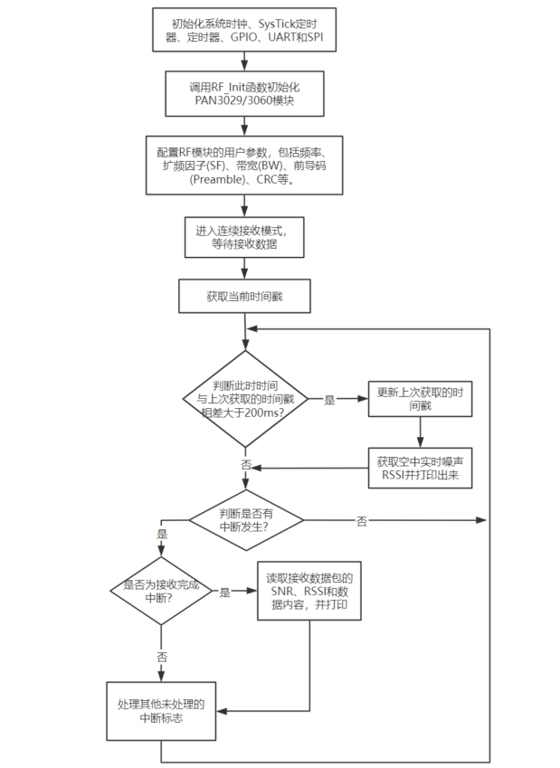

# 05_noise_rssi例程
## 1.功能描述
本代码示例主要演示了PAN3029/3060在接收模式下的噪声能量检测功能，可检测环境中当前信道的噪声能量大小。本功能借助两块开发板进行共同演示，一块开发板负责循环发送数据包，模拟真实环境中的射频信号; 另一块开发板用于实时检测环境噪声能量，并获取接收到数据包的 RSSI 值。

## 2.环境要求
*   Board: PAN3029 开发板
*   Mini USB线2根，用于给开发板供电和查看串口打印Log
*   J-Link下载器一个，用于程序下载
*   将 J1，J4用跳帽连接

## 3.编译和烧录
一块开发板打开`01_SDK/example/05_noise_rssi/keil`目录下的noise_rssi_detect.uvprojx工程，并编译烧录代码，进行检测环境实时噪声和接收数据包，并获取当前数据包的信号强度。

另一块开发板烧录`01_SDK/example/01_normal_trx/tx`示例，进行数据包的循环发送。

## 4.核心接口
**接口申明：** <br>
获取实时RSSI值：

```c
int8_t RF_GetRealTimeRssi(void)
```

**接口定义：** 

```c
/**
 * @brief 获取实时RSSI值
 * @param <none>
 * @return RSSI值
 * @note RSSI值范围：-128~0，单位dBm
 * @note 调用此函数前需须保证RF处于接收状态
 */
int8_t RF_GetRealTimeRssi(void)
{
    /* 将寄存器0x06的Bit[2]清零再置为1，即可更新[Page1][Reg0x7E]的值 */
    RF_ResetPageRegBits(2, 0x06, 0x04);
    RF_SetPageRegBits(2, 0x06, 0x04);

    return (int8_t)RF_ReadPageReg(1, 0x7E);
}
```

## 5.应用范例

**代码流程：** 



**主要代码：** 
```c
    RF_EnterContinousRxState(); /* 进入连续接收状态 */
    LastSystemTickMs = SysTick_GetTick();
    while (1)
    {
        /* 每200ms打印一次噪声RSSI值 */
        if (SysTick_GetTick() - LastSystemTickMs > 200)
        {
            LastSystemTickMs = SysTick_GetTick(); /* 更新上次打印时间 */
            printf("Noise rssi:%ddBm\r\n", RF_GetRealTimeRssi()); /* 从函数RF_GetRealTimeRssi()中获取空中实时RSSI */
        }
        
        if (CHECK_RF_IRQ()) /* 检测到RF中断，高电平表示有中断 */
        {
            uint8_t IRQFlag = RF_GetIRQFlag();    /* 获取中断标志位 */
            if (IRQFlag & RF_IRQ_RX_DONE) /* 接收完成中断 */
            {
                // 此处获取并打印接收到数据包的相关参数
                RF_ClrIRQFlag(RF_IRQ_RX_DONE); /* 清除接收完成中断标志位 */
                IRQFlag &= ~RF_IRQ_RX_DONE;
            }
            // 此处清理其他未处理的中断标志位
        }
    }
```


## 6.例程演示
1. 准备两块 PAN3029 开发板，将对应代码分别烧录至开发板：发送端烧录数据发送代码，接收端烧录 noise_rssi 检测代码。
2. 打开串口调试助手，设置波特率为115200bps，数据位8位，无校验位，停止位1位。分别选定发送端与接收端对应的串口号，点击连接。
3. 观察接收端的串口调试助手界面，在没有接收数据包时，会周期性打印出当前空中噪声能量大小。
4. 发送端按固定周期持续发送数据包，此时在接收端串口调试助手中，查看接收到数据包的 Rssi值 (接收信号强度)和数据内容。

RX端日志:
```
Noise rssi:-79dBm              //环境实时噪声RSSI

Noise rssi:-79dBm

Noise rssi:-79dBm

Noise rssi:-79dBm

Noise rssi:-79dBm

+Rx Len=10, Count=37           //Tx端发送后，Rx接收到的数据包
+RxHexData:
00 01 02 03 04 05 06 07 08 09 
SNR:9dB, RSSI:-44dBm          //数据包的RSSI值
```
* `Noise rssi:-79dBm`为每隔200ms检测的环境噪声RSSI值。
* `RSSI: -44`为数据包的信号强度值。
