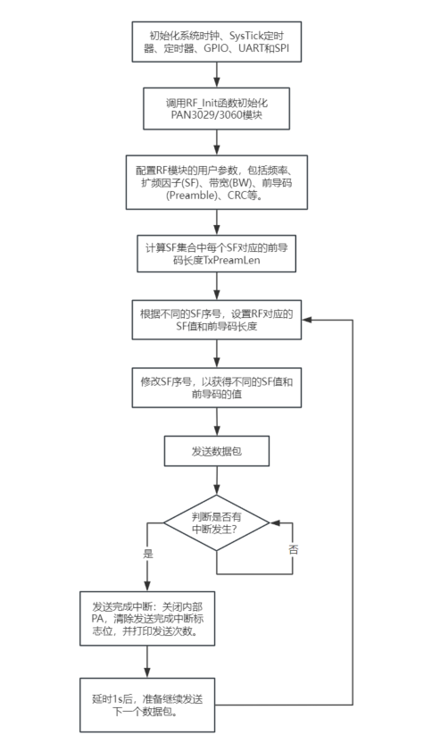
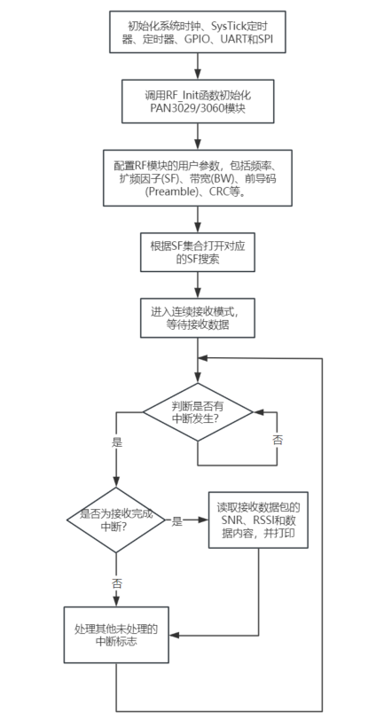

# 06_auto_sf例程
## 1.功能描述
本代码示例主要演示了PAN3029/3060 自动识别空中数据包的sf参数的功能，达到接收不同sf数据包的目的。自动搜索功能使用时，接收端需要配置sf搜索范围，发射端需要根据不同sf配置不同的前导码个数。

## 2.环境要求
*   Board: 两块PAN3029 开发板
*   Mini USB线2根，用于给开发板供电和查看串口打印Log
*   J-Link下载器一个，用于程序下载
*   将 J1，J4用跳帽连接

## 3.编译和烧录
一块开发板烧录`01_SDK/example/06_auto_sf/tx/keil`目录下的auto_sf_tx.uvprojx工程，用于发送不同sf参数的数据包。

另一块开发板烧录`01_SDK/example/06_auto_sf/rx/keil`目录下的auto_sf_rx.uvprojx工程，用于自动识别信道中的sf参数，并接收数据包。

## 4.auto_sf_tx端
**代码流程：** 



**主要代码：** 
```c
RF_ConfigUserParams();          /* 配置 frequency、SF、BW、Preamble、CRC等参数  */
CalculateTxPreamLenBySF(g_AutoSfPream, AUTO_SF_NUM); /* 计算SF集合中每个SF对应的TxPreamLen  */

while(1)
{
    RF_SetSF(g_AutoSfPream[SF_Index].Sf);               /* 设置SF值  */
    RF_SetPreamLen(g_AutoSfPream[SF_Index].TxPreamLen); /* 设置SF对应的前导码长度  */
    RF_TxSinglePkt(g_TxBuf, sizeof(g_TxBuf)); /* 发送数据包 */
    while (1)
    {
        if (CHECK_RF_IRQ()) /* 检测到RF中断，高电平表示有中断 */
        {
            uint8_t IRQFlag = RF_GetIRQFlag();    /* 获取中断标志位 */
            if (IRQFlag & RF_IRQ_TX_DONE) /* 发送完成中断 */
            {
                RF_TurnoffPA();                /* 发送完成后须关闭PA */
                RF_ClrIRQFlag(RF_IRQ_TX_DONE); /* 清除发送完成中断标志位 */
                IRQFlag &= ~RF_IRQ_TX_DONE;
                RF_EnterStandbyState();        /* 发送完成后须设置为RF_STATE_STB3状态 */
                break;
            }
            // 此处清理其他未处理的中断标志位
        }
    }
    SysTick_Delay(1000); /* 延时1秒 */
}
```

## 5.auto_sf_rx端
**核心接口：** 

```c
static void RF_EnableAutoSF(AutoSfPream_t *pSfPream, int SF_Num);
```

**接口功能：** 基于指定的扩频因子（SF）集合激活对应的 SF 搜索功能。在 RF_EnableAutoSF() 函数会根据输入参数，动态配置并启用 SF5 至 SF12 范围内的特定扩频因子搜索能力。

**代码流程：** 



**主要代码：** 
```c
RF_ConfigUserParams(); /* 配置 frequency、SF、BW、Preamble、CRC等参数  */
CalculateTxPreamLenBySF(g_AutoSfPream, AUTO_SF_NUM); /* 计算SF集合中每个SF对应的TxPreamLen */

while(1)
{
    RF_SetSF(g_AutoSfPream[SF_Index].Sf);               /* 设置SF值  */
    RF_SetPreamLen(g_AutoSfPream[SF_Index].TxPreamLen); /* 设置SF对应的前导码长度  */
    RF_TxSinglePkt(g_TxBuf, sizeof(g_TxBuf));           /* 发送数据包 */
    while (1)
    {
        if (CHECK_RF_IRQ()) /* 检测到RF中断，高电平表示有中断 */
        {
            uint8_t IRQFlag = RF_GetIRQFlag(); /* 获取中断标志位 */
            if (IRQFlag & RF_IRQ_TX_DONE)      /* 发送完成中断 */
            {
                RF_TurnoffPA();                /* 发送完成后须关闭PA */
                RF_ClrIRQFlag(RF_IRQ_TX_DONE); /* 清除发送完成中断标志位 */
                IRQFlag &= ~RF_IRQ_TX_DONE;
                RF_EnterStandbyState();        /* 发送完成后须设置为RF_STATE_STB3状态 */
                break;
            }
            // 此处清理其他未处理的中断标志位
        }
    }
    SysTick_Delay(1000); /* 延时1秒 */
}
```

## 6.例程演示
1. 准备两块 PAN3029 开发板，将`08_auto_sf/tx`和`08_auto_sf/rx`例程分别烧录至对应开发板。
2. 开启串口调试助手，将波特率设定为 115200bps，数据位设为 8 位， 选择无校验位，停止位设为 1 位。 分别选中发送端和接收端的串口号，点击连接。
3. 观察发送端是否能够成功发送包含不同扩频因子和不同前导码长度的数据包。
4. 观察接收端是否能够识别并接收带有不同扩频因子的数据包。

**TX端日志:** 
```
Tx SF:5, PreamLen:64        //发送数据包的SF值和前导码长度
Tx Count:4761               //发送数据包的计数值

Tx SF:6, PreamLen:33
Tx Count:4762

[15:11:19.308]Tx SF:7, PreamLen:17
x Count:4763

 SF:8, PreamLen:9
x Count:4764

x SF:9, PreamLen:8
Tx Count:4765
```

**RX端日志:** 
```
+RxLen=16, Rx Count=11857, Rx SF:5    //sf值被自动识别，并正确打印接收到的数据
+RxHexData:
00 00 00 00 00 00 00 00 00 00 00 00 00 00 00 00 
SNR:2dB, RSSI:-13dBm 

+RxLen=16, Rx Count=11858, Rx SF:6
+RxHexData:
01 01 01 01 01 01 01 01 01 01 01 01 01 01 01 01 
SNR:5dB, RSSI:-13dBm 

+RxLen=16, Rx Count=11859, Rx SF:7
+RxHexData:
02 02 02 02 02 02 02 02 02 02 02 02 02 02 02 02 
SNR:8dB, RSSI:-13dBm 

+RxLen=16, Rx Count=11860, Rx SF:8
+RxHexData:
03 03 03 03 03 03 03 03 03 03 03 03 03 03 03 03
SNR:0dB, RSSI:-13dBm 

+RxLen=16, Rx Count=11861, Rx SF:9
+RxHexData:
04 04 04 04 04 04 04 04 04 04 04 04 04 04 04 04  
SNR:0dB, RSSI:-12dBm 
```

## 7.特别注意
- 自动搜索功能不能与CAD功能同时使用。
- 自动搜索功能支持根据实际需求配置不同的SF搜索范围，建议选择连续的SF值进行智能搜索，例如SF7~9。
