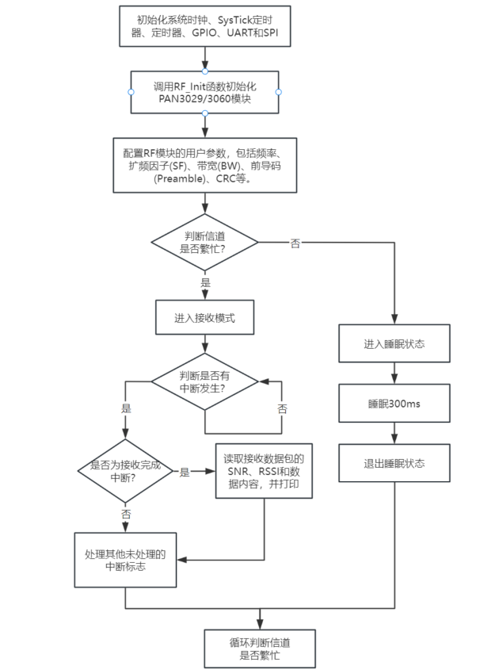
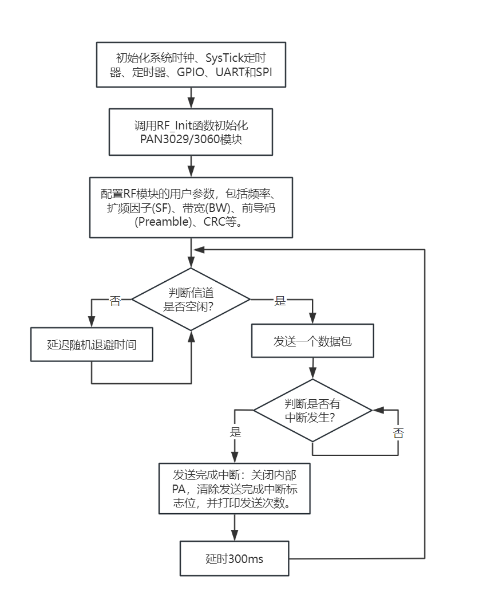

# 07_cad例程
## 1.功能描述
本代码示例主要演示PAN3029/3060进行CAD检测的功能。开启CAD功能并进入Rx模式后，芯片会检测信道中是否存在ChirpIOT™信号，如果存在则将CAD-IRQ置高，外部MCU可以通过在一定时间内检测CAD-IRQ信号是否拉高来判断信道中是否存在 ChirpIOT™信号。

关于CAD的详情可参考文档`03_DOC/PAN3029_3060_CAD应用指南_v1.4.pdf`。

## 2.环境要求
*   Board: 三块PAN3029 开发板
*   Mini USB线2根，用于给开发板供电和查看串口打印Log
*   J-Link下载器一个，用于程序下载
*   将 J1，J4用跳帽连接

## 3.编译和烧录
一块开发板烧录`01_SDK/example/07_cad/tx_with_lbt/keil`目录下的tx_with_lbt.uvprojx工程，用于确认当前信道处于空闲状态后发送数据包。

另一块开发板烧录`01_SDK/example/07_cad/rx_with_cad/keil`目录下的rx_with_cad.uvprojx工程，当检测到信道中有ChirpIOT™信号时，进入接收模式并接收数据包。

## 4.rx_with_cad
**功能介绍：** CAD 功能用于接收前的信道检测，通过检查当前信道是否存在ChirpIOT™信号来决定继续接收或关闭接收并进入睡眠状态。

**代码流程：**



**主要代码：** 

```c
int ret = RF_Init();   /* PAN3029/3060初始化 */
RF_ConfigUserParams(); /* 配置 Frequency、SF、BW、Preamble、CRC等参数 */

while (1)
{
    /**
     * 用IsChannelBusy函数检测信道是否空闲
     * - 如果信道忙，表示空中有数据包，则进入接收模式
     * - 如果信道空闲，表示空中没有数据包，则进入睡眠模式
     */
    if (IsChannelBusy())
    {
        RF_EnterSingleRxWithTimeout(2000); /* 进入带超时的单次接收模式，超时时间为2000ms */

        while (1)
        {
            if (CHECK_RF_IRQ()) /* 检测到RF中断，高电平表示有中断 */
            {
                uint8_t IRQFlag = RF_GetIRQFlag();    /* 获取中断标志位 */
                if (IRQFlag & RF_IRQ_RX_DONE) /* 接收完成中断 */
                {
                    // 此处打印接收到数据包的相关信息
                    RF_ClrIRQFlag(RF_IRQ_RX_DONE); /* 清除接收完成中断标志位 */
                    IRQFlag &= ~RF_IRQ_RX_DONE;
                }
                // 此处清理其他未处理的中断标志位
                break; /* 退出接收循环 */
            }
        }
    }
    else
    {
        RF_EnterSleepState(); /* 进入睡眠模式 */
        RF_DelayMs(300);     /* 休眠300ms时间 */
        RF_ExitSleepState();  /* 退出睡眠模式 */
    }
}
```


## 5.tx_with_lbt
**功能介绍：** CAD功能可以被用于发射前的信道检测LBT(Listen Before Talk)，以监听信道是否空闲，随后进行数据发射，避免无线信号碰撞干扰，提高通信成功率。本示例用到三块开发板，两块用于发送一块用于接收。主要检验当信道空闲时，数据包是否被成功发送；当信道繁忙时，可通过设置随机延时时间并多次等待信道空闲时再发送数据，延时时间和等待次数可灵活调整。

**代码流程：** 



**主要代码：** 

```c
/**
 * @brief 带LBT的发送函数
 * @param Buffer 要发送的数据缓冲区
 * @param Len 要发送的数据字节数
 * @return 发送结果
 *       - true: 发送成功
 *       - false: 发送失败
 * @note 该函数会在发送前进行CAD检测，如果信道忙则会进行退避重试
 */
static bool sendPacketWithLBT(uint8_t *Buffer, size_t Len)
{
    int Retry = 0;
    while (Retry < MAX_RETRIES)
    {
        if (!IsChannelBusy()) /* 判断信道是否空闲 */
        {
            /* 信道空闲，发送数据 */
            RF_TxSinglePkt(Buffer, Len);
            while (1)
            {
                if (CHECK_RF_IRQ()) /* 检测到RF中断，高电平表示有中断 */
                {
                    uint8_t IRQFlag = RF_GetIRQFlag(); /* 获取中断标志位 */
                    if (IRQFlag & RF_IRQ_TX_DONE) /* 发送完成中断 */
                    {
                        // 此处为发送完成后，清除中断、关闭PA等操作
                        break; /* 退出RF中断处理循环 */
                    }
                    // 此处清理其他未处理的中断标志位
                }
            }
            return true;
        }
        else
        {
            /* 信道忙，触发退避，延迟随机退避时间 */
            RF_DelayMs(backoffTime);   /* 等待退避时间 */
            Retry++;
        }
    }
    return false;
}
```
## 6.例程演示
1. 找到3块PAN3029开发板，2块作为Tx端，1块作为Rx端。

2. 将`01_SDK/example/07_cad\tx_with_lbt\keil`和`01_SDK/example/07_cad\rx_with_cad\keil`分别烧录到Tx端和Rx端开发板中。

3. 打开串口调试助手，设置波特率为115200bps，数据位8位，无校验位，停止位1位。分别选择Tx端和Rx端的串口号，点击连接。

4. 观察2个发送端的开发板，是否成功开送数据包。<br>

   4.1 当CAD检测的信道为空闲时，成功发送数据包。<br>
   4.2 当CAD检测的信道为繁忙时，多次延时随机退避时间，待CAD检测的信道为空闲时再发送数据包。<br>
5. 观察Rx端是否检测到CAD信号，并成功接收到数据包。

**发送端日志:** 

```
bw: 9, sf: 7                            //发送端开始CAD信道检测
OneSymbolTime: 256 us
CAD detection time: 1640 us
channel is idle.                        //CAD检测信道为空闲状态，准备发送数据

Send packet success!                    //成功发送数据包

bw: 9, sf: 7                            //发送端开始CAD信道检测
OneSymbolTime: 256 us
CAD detection time: 1640 us
channel is busy, wait and try...        //CAD检测信道为繁忙状态，延时退避时间后重试
backoffTime: 2382 ms
```

**接收端日志:** 

```
Exit sleep mode.
bw: 9, sf: 7                             //接收端开始CAD信道检测
OneSymbolTime: 256 us
CAD detection time: 1640 us
Channel is free, enter sleep mode.       //CAD检测信道为空闲状态，准备睡眠

Exit sleep mode.
bw: 9, sf: 7                             //接收端开始CAD信道检测
OneSymbolTime: 256 us
CAD detection time: 1640 us
Symbol is detected, enter rx mode.       //CAD检测信道为繁忙状态，进入接收模式

+Rx Len=16, Count=57                     //接收到数据包
+RxHexData:
35 35 35 35 35 35 35 35 35 35 35 35 35 35 35 35 
SNR:0dB, RSSI:-81dBm 
bw: 9, sf: 7
OneSymbolTime: 256 us
CAD detection time: 1640 us
Channel is free, enter sleep mode.
```


## 7.特别注意
在使用CAD功能时，需要根据应用场景配置`RF_StartCad(uint8_t threshold, uint8_t chirps)`函数中的入参，在CAD检测过程结束后，须调用`RF_StopCad()`函数关闭CAD功能，然后调用`RF_EnterContinousRxState()`进入连续接收模式，或者调用`RF_EnterSingleRxWithTimeout(3000)`进入带超时的接收模式。
