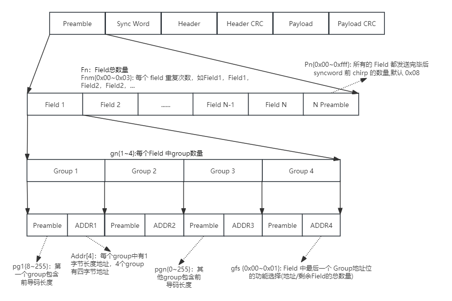
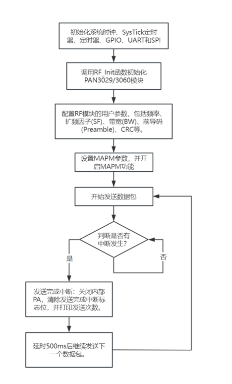
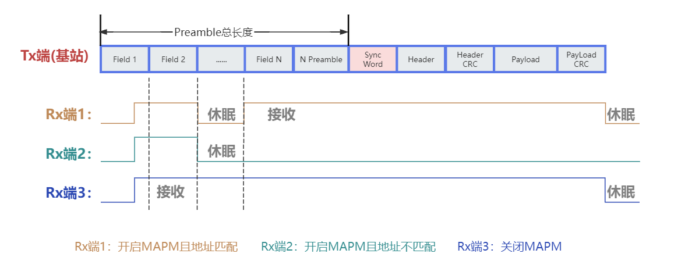
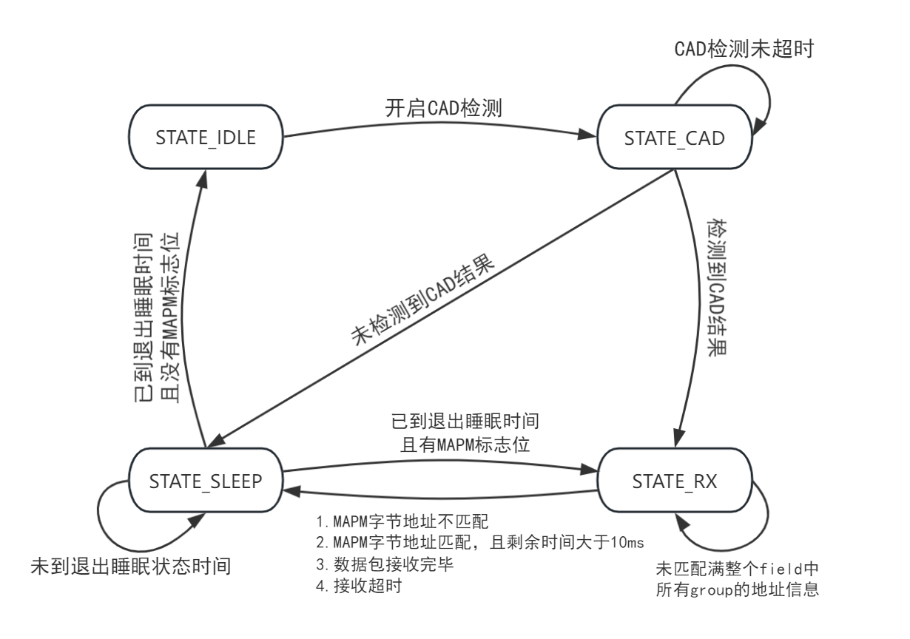

# 08_mapm例程
## 1. 功能描述

本代码示例主要演示了 PAN3029/3060 的 MAPM（Multiple Address Preamble Mode）功能。
* MAPM 在传统前导码中嵌入地址识别信息，使接收端在解析部分前导码后即可快速判断是否为目标接收方，无需等待完整前导码接收完成，从而显著缩短无效接收时间。
* MAPM 通过在前导码中添加可变计数器字段，精确指示后续前导码长度。当接收设备确认地址匹配后，可提前进入低功耗休眠状态，并根据计数器值动态调整唤醒时机，在保证数据完整接收的同时最大限度降低功耗。

本示例包含三组对比实验，验证不同配置下的接收行为：
* 接收端启用 MAPM 并匹配前导码地址，执行周期性休眠→唤醒→接收流程。
* 接收端启用 MAPM 但地址不匹配，休眠指定时间后重新进行前导码检测。
* 接收端 MAPM 关闭场景下，持续全量接收前导码及数据包。

关于MAPM的详情可参考文档`03_DOC/PAN3029_3060_MAPM应用指南_v1.4.pdf`。

## 2.环境要求
*   Board: 两块 PAN3029 开发板
*   Mini USB线2根，用于给开发板供电和查看串口打印Log
*   J-Link下载器一个，用于程序下载
*   将 J1，J4用跳帽连接

## 3.编译和烧录
一块开发板烧录`01_SDK/example/08_mapm/mapm_tx/keil`示例代码，用于在 MAPM 模式下循环发送数据包。
另一块开发板烧录`01_SDK/example/08_mapm/mapm_rx/keil`示例代码，用于通过检测MAPM前导码中的匹配地址，动态决策是否继续执行接收流程。

## 4.核心结构体
```c
typedef struct //MAPM参数
{
    uint8_t Addr[4];      //group中的地址，每个group占一字节!
    uint8_t fn;           //field的总个数
    uint8_t fnm;          //每个field重复次数，可设置为0~3，通常设置为0
    uint8_t gfs;          //每个field中最后一个group中载荷的功能(地址/剩余field计数器)
    uint8_t gn;           //每个field中group的个数
    uint8_t pg1;          //每个field中第一个group的前导码长度
    uint8_t pgn;          //每个field中其它group的前导码长度
    uint16_t pn;          //在最后一个field后，同步字前的前导码长度
} RF_MapmCfg_t;
```
具体可参考下图：



## 5.mapm_tx例程
**代码流程：** 



**主要代码：** 

```c
int ret = RF_Init();   /* PAN3029/3060初始化 */
RF_ConfigUserParams(); /* 配置 Frequency、SF、BW、Preamble、CRC等参数 */

g_CurrMapmCfg = g_MapmCfg[0]; // Get cuurrent mapm config ,first g_MapmCfg is SF5 mapm config
RF_SetMapmAddr((uint8_t *)g_CurrMapmCfg.Addr, sizeof(g_CurrMapmCfg.Addr));  /* 发端数据包中MAPM的地址 */
RF_ConfigMapm((RF_MapmCfg_t *)&g_CurrMapmCfg);                              /* 设置MAPM相关参数 */
RF_EnableMapm();                                                            /* 开启MAPM相关功能 */

while(1)
{   
    RF_TxSinglePkt(g_TxBuf, sizeof(g_TxBuf)); /* 发送数据包 */
    while (1)
    {
        if (CHECK_RF_IRQ()) /* 检测到RF中断，高电平表示有中断 */
        {
            uint8_t IRQFlag = RF_GetIRQFlag();    /* 获取中断标志位 */
            if (IRQFlag & RF_IRQ_TX_DONE) /* 发送完成中断 */
            {
                RF_TurnoffPA();                /* 发送完成后须关闭PA */
                RF_ClrIRQFlag(RF_IRQ_TX_DONE); /* 清除发送完成中断标志位 */
                IRQFlag &= ~RF_IRQ_TX_DONE;
                RF_EnterStandbyState();        /* 发送完成后须设置为RF_STATE_STB3状态 */
                break;
            }
            // 此处清理其他未处理的中断标志位
        }
    }
    SysTick_Delay(1000); /* 延时1秒 */
}
```

## 6.mapm_rx例程
### 6.1 Rx端接收时序

 

### 6.2 Rx端代码流程 

1. 初始化系统时钟、SysTick定时器、定时器、GPIO、UART和SPI。
2. 调用RF_Init函数初始化PAN3029/3060模块。
3. 配置RF模块的用户参数，包括频率、扩频因子(SF)、带宽(BW)、前导码(Preamble)、CRC等。
4. 设置MAPM模块参数，包括field数量、一个filed中的group数量等。
5. 设置接收端前导码中的地址信息。
6. 开启MAPM模式。
7. 获取单个symbol时间，重置接收端的group序号。
8. 清除中断标志位，并进入连续中断模式
9. 进入loop循环，具体看如下状态图。
    
* 注：MAPM标志位表示发送的数据包和自身地址相匹配。MAPM标志位默认为False，当收到的数据包前导码和自身地址匹配时，MAPM标志位变为True；当接收完成或者接收超时后，MAPM标志位变为False。


## 7.例程演示
### 7.1 准备工作

1. 找到两块PAN3029开发板，分别配置为Tx端和Rx端，并向对应开发板烧录配套固件。

2. 打开串口调试助手，设置波特率为115200bps，数据位8位，无校验位，停止位1位。分别选择 Tx 端和 Rx 端的串口号，点击连接。

3. 确认 Tx 端正确在前导码中嵌入目标地址信息，并成功发送包含 MAPM 前导码的数据包。

4. 验证 Rx 端在不同配置下能否正确接收数据并执行对应行为：

   > - 当接收端开启 MAPM 并且成功匹配地址后，是否进入预设休眠周期，再唤醒并完整接收数据包。
   >
   > - 当接收端关闭 MAPM 后，是否接收端全程接收完整前导码，并正确解析数据包内容。
   >
   > - 当接收端开启 MAPM 并且不匹配地址后，是否立即终止前导码接收，并直接进入睡眠状态。

### 7.2 Tx端日志

```
RF mapm_tx test start.
Tx Count:1
Tx Count:2
Tx Count:3
```

### 7.3 Rx端日志

- **接收端开启MAPM并且成功匹配地址**

```
RF wakeup.
Expected CAD Time: 1 ms                             //进入CAD检测功能
CAD detected                                        //检测到有CAD信号

Get IRQ regiter:40                                  //检测到有MAPM中断，开始存储并比对地址
Recv Mapm:0x73

Get IRQ regiter:40
Recv Mapm:0x62

Get IRQ regiter:40
Recv Mapm:0x2F
MAPM Addr: 73 62 2F 
MAPM Addr match                                     //发送端和接收端地址匹配成功，准备进入休眠状态
MAPM Counter: 47
Left Mapm Time: 2949 ms, Should Sleep!              //计算休眠时长，并进入休眠状态

enter the STATE_RX.                                 //RF退出休眠状态，准备进入接收状态
RF wakeup.
Get IRQ regiter:40                                  //提前一个Field醒来会接收到最后一个Field的MAPM中断
Recv Mapm:0x73

Get IRQ regiter:40
Recv Mapm:0x62

Get IRQ regiter:40
Recv Mapm:0x01
MAPM Addr: 73 62 01 
MAPM Addr match
MAPM Counter: 1
Left Mapm Time: 0 ms, No need to Sleep! goon rx    //忽略最后一个Field继续接收

Get IRQ regiter:8                                  //接收成功，触发接收完毕中断
+Rx Len=16, Count=30
+RxHexData:
00 01 02 03 04 05 06 07 08 09 0A 0B 0C 0D 0E 0F 
SNR:9dB, RSSI:-63dBm 
Enter sleep state.
```

- **接收端关闭MAPM后** 

```
RF wakeup. 
Expected CAD Time: 1 ms
CAD detected                     //检测到CAD信号，准备接收数据

Get IRQ regiter:8                //接收数据成功，打印接收到的数据
+Rx Len=16, Count=4
+RxHexData:
00 01 02 03 04 05 06 07 08 09 0A 0B 0C 0D 0E 0F 
SNR:7dB, RSSI:-13dBm 
```

- **当接收端开启MAPM并且不匹配地址** 

```
RF wakeup.
Expected CAD Time: 1 ms
CAD detected

Get IRQ regiter:40               //MAPM中断触发，准备进入地址匹配
Recv Mapm:0x73

Get IRQ regiter:40
Recv Mapm:0x62

Get IRQ regiter:40
Recv Mapm:0x07
MAPM Addr: 73 62 07 
MAPM Addr not match              //地址匹配失败，准备进入休眠

RF wakeup.                       //休眠结束，准备再次进入CAD检测
Expected CAD Time: 1 ms
CAD detected
Get IRQ regiter:40
Recv Mapm:0x73

Get IRQ regiter:40
Recv Mapm:0x62

Get IRQ regiter:40
Recv Mapm:0x36
MAPM Addr: 73 62 36 
MAPM Addr not match
```
