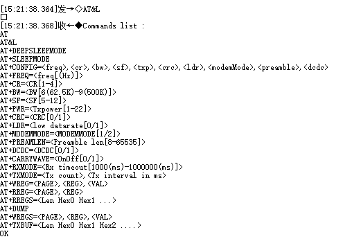

# 09_atcmd例程
## 1.功能描述
本代码示例基于AT指令集通信，实现对PAN3029无线通信模组的全功能控制。通过UART 接口与串口调试工具完成指令交互，实现参数配置、数据收发等功能。

## 2.环境要求
*   Board: PAN3029 开发板
*   Mini USB线2根，用于给开发板供电和查看串口打印Log和AT指令设置
*   J-Link下载器一个，用于程序下载
*   将 J1，J4用跳帽连接

## 3.编译和烧录
例程位置：`01_SDK/example/09_atcmd/keil`
打开目录下的atcmd.uvprojx工程，并编译整个代码工程。

## 4.使用说明
根据**环境要求**一节的介绍，正确连接2套 EVB 开发板的跳线，编译、下载程序：
1.  在电脑上打开串口调试工具，串口参数：115200bps/8bit/1stop/无校验
2.  观察串口打印的内容，理论上初始化成功后，串口会打印相关信息
3.  一个设备AT指令配置发送，一个设备AT指令配置接收，进行通信测试

**初始化后串口输出信息如下：** <br>

```
AT server initialize success.RF atcmd server start.
```

## 5.例程演示
<strong>发送指令例程：</strong><br>
以 Tx 端发送数据包、Rx 端接收数据包为例：首先在 Tx 端和 Rx 端分别通过 AT 指令完成 RF 参数设置，然后在 Rx 端通过 AT 指令配置持续 6 秒的数据包接收窗口，最后在 Tx 端使用 AT 指令发送 3 个时间间隔为 1 秒的数据包，具体发送 / 接收的 AT 指令和对应的日志如下：

**RF参数设置：** <br>
串口发送指令：

```
AT+CONFIG=493000000,1,9,5,22,1,0,1,8,0\r\n
```
串口日志显示:
```
freq:493000000
cr:1
bw:9
sf:5
txpower:22
crc:1
ldr:0
modemMode:1
preamble:8
dcdc:0
RF init ok
OK
```

**RF参数详解：** <br>

<table border="1">
  <tr>
    <td>命令类型</td>
    <td>命令格式</td>
    <td>响应</td>
  </tr>
  <tr>
    <td>查询命令</td>
    <td>AT+CONFIG?\r\n</td>
    <td>+CONFIG=493000000,1,9,5,22,1,0,1,8,0 <br> OK</td>
  </tr>
  <tr>
    <td>参数说明</td>
        <td colspan="2">AT+CONFIG=[freq],[cr],[bw],[sf],[txp],[crc],[ldr],[modemMode],[preamble],[dcdc]<br>
        [freq]：频率值，单位赫兹（Hz）<br>
        [cr]：编码率 CodingRate 值，取值范围 1-4（1=4/5，2=4/6，3=4/7，4=4/8）<br>
        [bw]：信道带宽 BW 值，取值范围 6-9（6=62.5KHz，7=125KHz，8=250KHz，9=500KHz）<br>
        [sf]：扩频因子 SF 值，取值范围 5-12<br>
        [txp]：功率挡位，取值范围 1-22（功率挡位，挡位值越大功率越大）<br>
        [crc]：CRC 校验功能开关，取值范围 0-1（0=关闭，1=开启）<br>
        [ldr]：低速率 LDR 功能开关，取值范围 0-1（0=关闭，1=开启）<br>
        [modemMode]：波形功能选择，取值范围 1-2<br>
        [preamble]：前导码长度，取值范围 8-65535<br>
        [dcdc]：DCDC 功能开关，取值范围 0-1（0=关闭，1=开启）
    </td> <!-- 合并第2、3列 -->
  </tr>
  <tr>
    <td>执行指令</td>
    <td colspan="2">AT+CONFIG=490000000,4,9,11,22,1,0,1,8,0\r\n<br>
    表示设置模组的频率 490MHz，CR=4，BW=500K，SF=11，POWER=22，CRC 打开，
    LDR 关闭，modemMode=1，preamble=8，dcdc 关闭</td> <!-- 合并第2、3列 -->
  </tr>
</table>
​      

<strong>Tx端例程演示</strong><br>

**RF发送命令：** <br>
共发送三包数据，1000ms发送一次。

```
AT+TXMODE=3,1000\r\n
```
**Tx端串口日志显示:**<br>

```
RF enter tx mode
Start to tx 10 bytes.
Packet on air time:108 ms.
RF TX DONE! Tx Count:1.

Start to tx 10 bytes.
Packet on air time:108 ms.
RF TX DONE! Tx Count:2.

Start to tx 10 bytes.
Packet on air time:108 ms.
RF TX DONE! Tx Count:3.
RF tx 3 packets done.
RF exit tx mode
OK
```
**Rx端例程演示**<br>

**RF接收命令：**<br>

连续接收，没有超时，直到用户输入'c'退出接收模式。

```
AT+RXMODE=0\r\n
```
接收超时时间为6000ms。

```
AT+RXMODE=6000\r\n
```

**Rx端串口日志显示:**<br>

```
RF enter rx mode
Receive 'C' or 'c' from uart will break rx task.

+RxLen=10, Rx Count=1.
+RxHexData:
01 02 03 04 05 06 07 08 09 0A 
SNR:9dB, RSSI:-66dBm 

RF rx timeout: 6000ms
RF exit rx mode
OK
```

发送`AT&L\r\n`指令可查看详细的AT指令列表，如下图所示：



其它AT指令说明参考`03_DOC/PAN3029_3060_AT指令说明_v1.2.pdf`。
