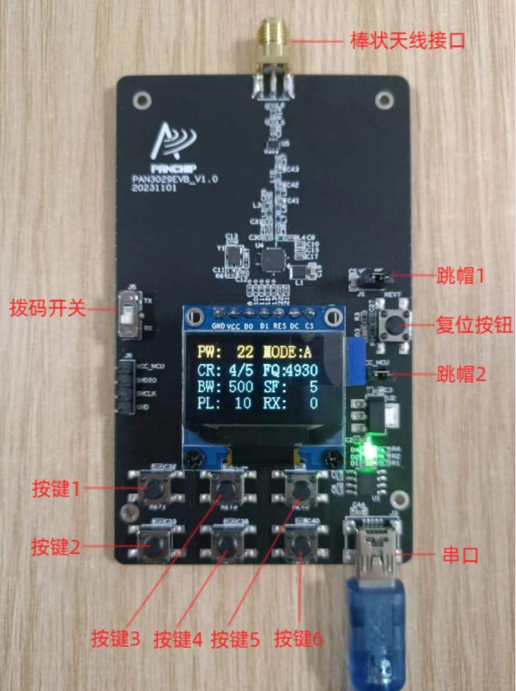

# 10_oled例程
## 1.功能描述
本oled工程测试代码提供按键修改射频参数，屏幕显示通信结果等功能，用户使该例程代码可以进行点对点的通信距离、接收灵敏度、单载波、RF功耗等测试。

## 2.环境要求
*   Board: PAN3029 开发板
*   Mini USB线2根，用于给开发板供电和查看串口打印Log
*   J-Link下载器一个，用于程序下载
*   将 J1，J4用跳帽连接

## 3.编译和烧录
例程位置：`01_SDK/example/10_oled/keil`
打开目录下的oled.uvprojx工程，并编译整个代码工程。

## 4.使用说明
### 4.1 屏幕参数介绍

- **PW**：发送功率，即显示发送功率的挡位。

- **MODE**：发送模式选择，即点击发送按键后的发送数据包形式，总共A-D四种发送模式：

  > A:单包发送
  >
  > B:连续发送100包
  >
  > C:连续发送9999包
  >
  > D:单载波测试模式

- **CR**：编码率，主要用于前向纠错，对数据的可靠性有影响，不过不会影响传输距离。
- **FQ**：通信频率，显示精度为0.1MHz
- **BW**：带宽，扩频因子需要和带宽参数配合使用，在相同的扩频因子下，增加带宽能够提高数据速率，但会降低信号的抗干扰能力。
- **SF**：扩频因子，用于调整传输距离和数据速率之间的平衡关系。
- **RL**：有效载荷长度(PayloadLen)，指数据包中真正用于携带用户数据的部分。
- **RX**：发送/接收到的数据包个数。

### 4.2 跳帽/按键介绍
- **跳帽功能：** 

  跳帽1：RF模块供电跳帽，此处可以测量**RF芯片**的工作电流。

  跳帽2：HC32F460模块供电跳帽，此处可以测量**MCU**的工作电流。

- **按键功能：** 

  本EVB开发板总共有6个按键，其中 **KEY1** 为组合键，用于选择其他按键的第二功能，类似于键盘上的**shift按键**，因此其余5个按键都有第二功能，总计10个功能选择。

|      名称/功能       | 描述                                                         | 设置方法                                                     |
| :------------------: | ------------------------------------------------------------ | ------------------------------------------------------------ |
|   **PW**(TxPower)    | 发射功率，1-22 档位                                          | 按下 **KEY1** 保持，单击 **KEY6** 进行切换                   |
|   **Mode**(TxMode)   | **设置发包模式**： A 表示单包发送 B 表示连续发送 100 包 C 表示连续发送 9999 包 D 表示进入单载波测试模式 | 在TX 模式下，单击 **KEY4** 进行切换                          |
|  **CR**(CodingRate)  | **设置编码率**：  CR4/5、CR4/6、CR4/7、CR4/8            | 按下 **KEY1** 保持，单击 **KEY4** 进行切换                   |
|     **FQ**(Freq)     | 设置工作频点                                                 | 按下 **KEY1** 保持，单击 **KEY3** 进行切换                   |
|  **BW**(BandWidth)   | **设置信道带宽**： 支持 500KHz、250KHz、125KHz、62.5KHz | 单击 **KEY6**，进行切换                                      |
| **SF**(SpreadFactor) | **设置扩频因子**： 支持 5/6/7/8/9/10/11/12              | 单击 **KEY5**，进行切换                                      |
|  **PL**(PayloadLen)  | **设置发送数据长度**： 10-240 字节，10 字节/步进        | 按下 **KEY1** 保持，单击 **KEY5** 进行切换                   |
|     **发送数据**     | 按照所选配置开始发送数据包                                   | 单击 **KEY3** 即可按照 Mode 进行发送                         |
|  **清除收发包计数**  | 清除收/发包计数                                              | 单击 **KEY2** 清除收/发包计数                                |
|     **收发切换**     | 设备进行 TX 和 RX 模式切换                                   | 通过**拨码开关**切换 每次切换后需要按下**复位按键**重启EVB板 |
